# ARCHE Complete Prompt Templates

Extracted from the official ARCHE paper (arXiv:2511.12485v1, Appendix D)

---

## Primary Prompt: RLT Generation (Stage 1)

### Prompt Text

Charles S. Peirce, a member of the National Academy of Sciences of the United States, pointed out that all valid reasoning is either deductive, inductive, or hypothetic; or else it combines two or more of these characters. Now, I have an introduction section of a scientific article. Please extract its core scientific research proposal or idea, and use the above three types of reasoning to show the process of reasoning to get the idea. In the paper fragment I provided, the content part is the complete introduction paragraph, the sentence part is the original sentence of each paper, and the reference part is the viewpoint extracted from the abstract of the reference cited by the original sentence.

Please build a complete logical reasoning chain based on the content and viewpoints of the paper I provided. Please use Graphviz DOT syntax to output the entire graph and present it in the form of code blocks. Please strictly abide by the following requirements:

**Overall goal:** Extract the logical structure behind the scientific research idea from the original text. Its structure can be a tree structure diagram, which describes the process of reasoning from various raw information to get the scientific research idea. Specifically, you will build a single-rooted reasoning tree, and the following is the specific definition.

### Requirements

#### 1. Node Format

The node is divided into two parts:

**a) Source (three integers: X, Y, Z)**

Choose one of the following four formats:
- **Original sentence:** `(X: sentence_idx, Y: 0, Z: 0)`
- **Original viewpoint:** `(X: sentence_idx, Y: viewpoint_number, Z: 0)`
- **Reference viewpoint:** `(X: sentence_idx, Y: reference_number, Z: viewpoint_number)`
- **Implicit information for reasoning:** `(X: 0, Y: 0, Z: 0)`

**b) Transcription (a string)**

Considering that the original paper may not directly express the reasoning, you need to transcribe it into a sentence with a more obvious reasoning format.

**Examples:**
- **Deduction-rule node:** "If xxxx, then yyyy"
- **Deduction-case node:** "Currently there is xxxx"
- **Conclusion node (deduction):** "Deduction-reasoning: Currently there is xxxx, and if xxxx, then yyyy, so yyyy"

The above three examples are based on a deductive reasoning, and are required to strictly comply with the reasoning logic (i.e., the deduction-case situation should be exactly the part assumed in the deduction-rule).

#### 2. Edge Types

The edge type can **ONLY** be one of the following 6 types:
- `deduction-rule`
- `deduction-case`
- `abduction-phenomenon`
- `abduction-knowledge`
- `induction-case`
- `induction-common`

#### 3. CRITICAL CONSTRAINT - Edge Pairing Requirements

**Every reasoning conclusion must be reached by exactly two edges of specific paired types pointing to the same target node.**

The valid pairs are:
- **For deductive reasoning:** One `deduction-rule` edge AND one `deduction-case` edge must both point to the same target node
- **For abductive reasoning:** One `abduction-phenomenon` edge AND one `abduction-knowledge` edge must both point to the same target node
- **For inductive reasoning:** One `induction-case` edge AND one `induction-common` edge must both point to the same target node

#### 4. Other Constraints

- **Multi-hop reasoning:** If there is multi-hop reasoning in the reasoning chain (or a single reasoning/induction/deduction is not enough to explain clearly, such compound reasoning is common in scientific literature), please introduce intermediate nodes (as implicit information) to break down the logical path into multiple clear reasoning steps. The intermediate nodes must also be written with complete sentences and source annotations. The more detailed the reasoning and the more nodes there are, the higher the score will be.

- **Domain consensus:** Can be used as implicit information, but it cannot be written directly in the form of a conclusion, and must be written as callable background knowledge.

- **Dual-role nodes:** If a node is both the conclusion node of a certain reasoning (this is very common in scientific reasoning) and the argument node of the next reasoning, it can contain multiple transcribed sentences. Indicate according to different edges.

- **Single root node:** All nodes must serve the logical backbone, that is, all reasoning will eventually be reasoned to the same final node, which represents the determination of the scientific research idea. Therefore, there is only one root node with only input edges and no output edges; in addition, there must be no nodes that are abandoned after reasoning, and no isolated nodes that cannot be connected.

- **Research idea endpoint:** The end point of the reasoning chain is to propose a scientific research idea or method, and it does not need to extend to the discussion of the results.

- **High coverage:** Please ensure HIGH coverage of the original sentences (aim for at least 70% of sentences)

#### 5. Input Data

**PAPER CONTENT:**
```
{data["introduction"]["content"]}
```

**EXTRACTED SENTENCES AND VIEWPOINTS:**
```
{sentences_info}
```

---

## Repair Prompt: Structural Correction (Stage 2)

### Prompt Text

The DOT graph has structural issues that need to be fixed. **Please fix ALL structural problems while preserving content and maintaining the quality-coverage balance.**

### DETECTED ISSUES:
- Single root node missing
- Isolated nodes found
- Incorrect node formatting

### ORIGINAL DOT GRAPH (with issues):
```dot
{first_response}
```

### CRITICAL:
You must fix ALL issues while preserving reasoning content. You must also strictly follow ALL original format requirements below:

### COMPLETE FORMAT REQUIREMENTS (MUST BE FOLLOWED):

#### 1. NODE FORMAT REQUIREMENTS (EXACT COMPLIANCE):

Each node MUST follow this format:
```
node_id [label="(source_x,source_y,source_z) transcription_content"];
```

**Source formats:**
- Original sentence: `(sentence_idx,0,0)`
- Original viewpoint: `(sentence_idx,viewpoint_number,0)`
- Reference viewpoint: `(sentence_idx,reference_number,opinion_number)`
- Implicit knowledge: `(0,0,0)`

**Transcription requirements:** "If [condition], then [consequence]"; "Currently [specific situation]"; etc.

#### 2. EDGE TYPES (ONLY THESE 6 ALLOWED):
- `deduction-rule`
- `deduction-case`
- `abduction-phenomenon`
- `abduction-knowledge`
- `induction-case`
- `induction-common`

#### 3. EDGE PAIRING (ABSOLUTE REQUIREMENT):
- **Deductive:** `deduction-rule` + `deduction-case` → same target
- **Abductive:** `abduction-phenomenon` + `abduction-knowledge` → same target
- **Inductive:** `induction-case` + `induction-common` → same target

#### 4. STRUCTURE REQUIREMENTS:
- Exactly ONE root node
- No isolated nodes

#### 5. REASONING TYPE CLARIFICATIONS:
- **INDUCTIVE:** cases → rule
- **DEDUCTIVE:** rule + case → conclusion
- **ABDUCTIVE:** phenomenon + knowledge → hypothesis

### SPECIFIC FIXES REQUIRED:

1. **SINGLE ROOT NODE:** Ensure exactly one final node with no outgoing edges
2. **NO ISOLATED NODES:** Connect all nodes to the main reasoning chain
3. **PROPER EDGE PAIRING:** Each reasoning conclusion needs exactly 2 paired edges
4. **NODE FORMAT:** Fix node labels to use (X,Y,Z) source format
5. **SINGLE SOURCE PER NODE:** Each node must have exactly one source
6. **STANDARD EDGE TYPES ONLY:** Use only the 6 allowed types
7. **PRESERVE CONTENT:** Keep all reasoning transcriptions and source information

### YOUR TASK:
- Fix all structural issues while keeping the scientific reasoning content
- Ensure every reasoning step follows the proper paired-edge pattern
- Return ONLY the corrected DOT format graph, wrapped in ```dot code blocks

### PAPER CONTENT FOR REFERENCE:
```
{data["introduction"]["content"]}
```

### EXTRACTED SENTENCES FOR REFERENCE:
```
{sentences_info}
```

---

## Viewpoint Extraction Prompt (Preprocessing)

*Note: The paper doesn't provide an explicit prompt for viewpoint extraction, but indicates they used GPT-4o. Here's a reconstructed prompt based on the methodology:*

### Suggested Prompt

You are extracting fine-grained viewpoints from scientific text.

**Task:** Break down the following sentence into individual, atomic viewpoints (distinct claims or statements).

**Requirements:**
- Each viewpoint should express a single, complete idea
- Preserve the original meaning and technical terms
- Be as granular as possible without losing coherence
- Include all substantive claims from the sentence

**Sentence:**
```
{sentence_text}
```

**Output format:**
Return a JSON list of viewpoints:
```json
[
  "viewpoint 1",
  "viewpoint 2",
  ...
]
```

---

## Complete Workflow Template

### Step 1: Preprocess Paper

```python
# Extract introduction
introduction = extract_introduction(paper_pdf)
sentences = split_into_sentences(introduction)

# Extract viewpoints
viewpoints = []
for idx, sentence in enumerate(sentences):
    # From sentence
    vps = llm.extract_viewpoints(sentence)
    for v_idx, vp in enumerate(vps):
        viewpoints.append({
            'coord': (idx+1, v_idx+1, 0),
            'text': vp,
            'source': 'sentence'
        })

    # From references
    citations = extract_citations(sentence)
    for ref_idx, citation_id in enumerate(citations):
        abstract = get_abstract(citation_id)  # via Semantic Scholar
        ref_vps = llm.extract_viewpoints(abstract)
        for z_idx, ref_vp in enumerate(ref_vps):
            viewpoints.append({
                'coord': (idx+1, ref_idx+1, z_idx+1),
                'text': ref_vp,
                'source': f'reference_{citation_id}'
            })
```

### Step 2: Format Input for RLT Generation

```python
# Build sentences_info string
sentences_info = ""
for idx, sentence in enumerate(sentences):
    sentences_info += f"\n**Sentence {idx+1}:**\n{sentence}\n"

    # Add viewpoints from this sentence
    sent_vps = [vp for vp in viewpoints if vp['coord'][0] == idx+1 and vp['coord'][2] == 0]
    if sent_vps:
        sentences_info += "\n**Extracted Viewpoints:**\n"
        for vp in sent_vps:
            sentences_info += f"- ({vp['coord'][0]},{vp['coord'][1]},{vp['coord'][2]}): {vp['text']}\n"

    # Add reference viewpoints
    ref_vps = [vp for vp in viewpoints if vp['coord'][0] == idx+1 and vp['coord'][2] > 0]
    if ref_vps:
        sentences_info += "\n**Reference Viewpoints:**\n"
        for vp in ref_vps:
            sentences_info += f"- ({vp['coord'][0]},{vp['coord'][1]},{vp['coord'][2]}): {vp['text']}\n"

# Build primary prompt
primary_prompt = PRIMARY_PROMPT_TEMPLATE.format(
    content=introduction,
    sentences_info=sentences_info
)
```

### Step 3: Generate Initial RLT

```python
# Call LLM
response = llm.generate(primary_prompt)

# Extract DOT graph from code block
rlt_dot = extract_code_block(response, language='dot')
```

### Step 4: Validate and Repair

```python
# Validate structure
issues = validate_rlt_structure(rlt_dot)

if issues:
    # Build repair prompt
    repair_prompt = REPAIR_PROMPT_TEMPLATE.format(
        first_response=rlt_dot,
        content=introduction,
        sentences_info=sentences_info
    )

    # Generate corrected version
    repair_response = llm.generate(repair_prompt)
    rlt_dot = extract_code_block(repair_response, language='dot')

# Parse final graph
graph = parse_dot_graph(rlt_dot)
```

### Step 5: Evaluate (Optional)

```python
# Entity Coverage
core_entities = extract_core_entities(introduction)
graph_entities = extract_graph_entities(graph, viewpoints)
ec_score = len(core_entities & graph_entities) / len(core_entities) * 100

# Reasoning Edge Accuracy
reasoning_steps = extract_reasoning_steps(graph)
valid_steps = 0

for step in reasoning_steps:
    # Check structural validity
    if not check_edge_pairing(step):
        continue

    # LLM panel validation (3 models)
    votes = [
        llm_1.validate_step(step),
        llm_2.validate_step(step),
        llm_3.validate_step(step)
    ]

    # Majority vote (ties → correct)
    if sum(votes) >= 2:
        valid_steps += 1

rea_score = valid_steps / len(reasoning_steps) * 100

print(f"EC: {ec_score:.1f}%, REA: {rea_score:.1f}%")
```

---

## Key Implementation Notes

1. **Coordinate System is Critical:** Always preserve (x,y,z) for traceability
2. **Edge Pairing Enforcement:** Validate programmatically before expensive LLM calls
3. **Two-Stage Process:** ~60-80% of papers need repair (varies by model)
4. **Evaluation Uses Original Text:** Extract entities from source via coordinates, not from labels
5. **DAG Structure:** Use networkx to validate single root, no cycles, no isolated nodes

---

## Example DOT Output

```dot
digraph reasoning_tree {
    // Deductive reasoning example
    rule1 [label="(0,0,0) If MOFs have high porosity, then they can store large amounts of CO₂"];
    case1 [label="(3,1,0) MOFs are characterized by high porosity"];
    conclusion1 [label="(0,0,0) MOFs can store large amounts of CO₂"];

    rule1 -> conclusion1 [label="deduction-rule"];
    case1 -> conclusion1 [label="deduction-case"];

    // Inductive reasoning example
    common1 [label="(0,0,0) Materials with porous structures are generally suitable for gas capture"];
    case2 [label="(5,2,1) Zeolites with porous structures are suitable for gas capture"];
    case3 [label="(5,3,2) Activated carbon with porous structures is suitable for gas capture"];

    common1 -> conclusion2 [label="induction-common"];
    case2 -> conclusion2 [label="induction-case"];

    conclusion2 [label="(0,0,0) Porous materials are suitable for CO₂ capture applications"];

    // Abductive reasoning example
    phenomenon1 [label="(7,1,0) Current CO₂ capture methods are energy-intensive"];
    knowledge1 [label="(7,2,1) Photoelectrochemical devices can convert solar energy to chemical energy"];
    hypothesis1 [label="(0,0,0) Photoelectrochemical CO₂ capture could reduce energy consumption"];

    phenomenon1 -> hypothesis1 [label="abduction-phenomenon"];
    knowledge1 -> hypothesis1 [label="abduction-knowledge"];

    // Final research idea (root node)
    conclusion1 -> research_idea [label="deduction-case"];
    conclusion2 -> research_idea [label="deduction-rule"];
    hypothesis1 -> research_idea [label="induction-case"];

    research_idea [label="(0,0,0) Developing MOF-based photoelectrochemical devices for efficient CO₂ capture from seawater"];
}
```


