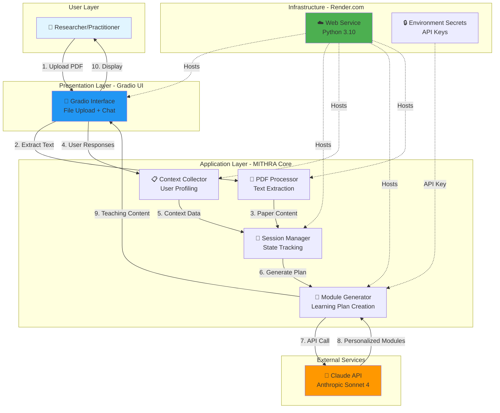
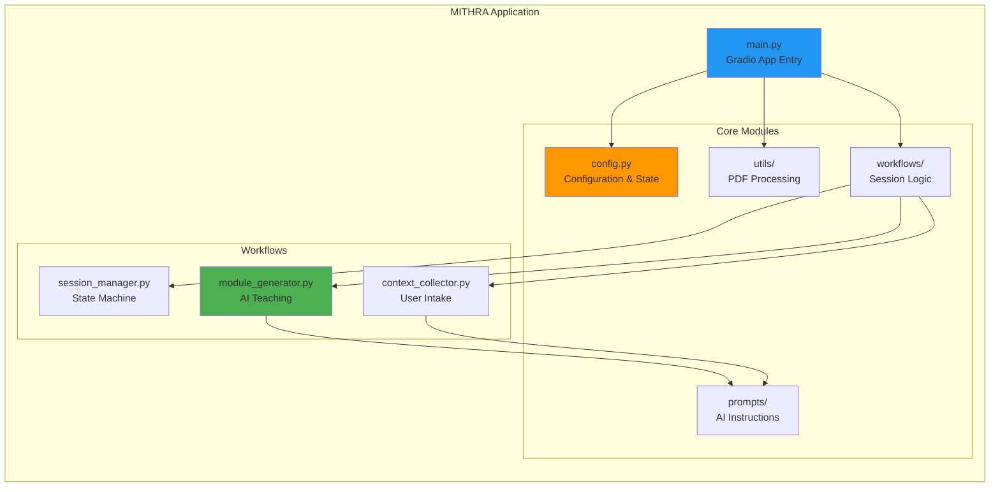
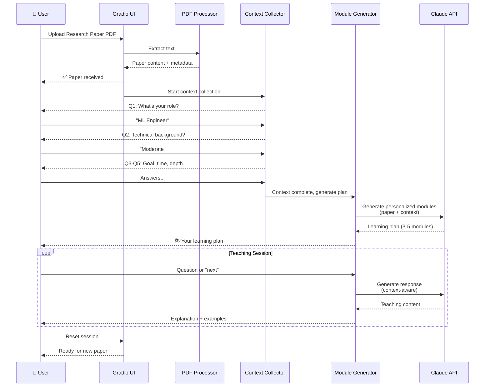
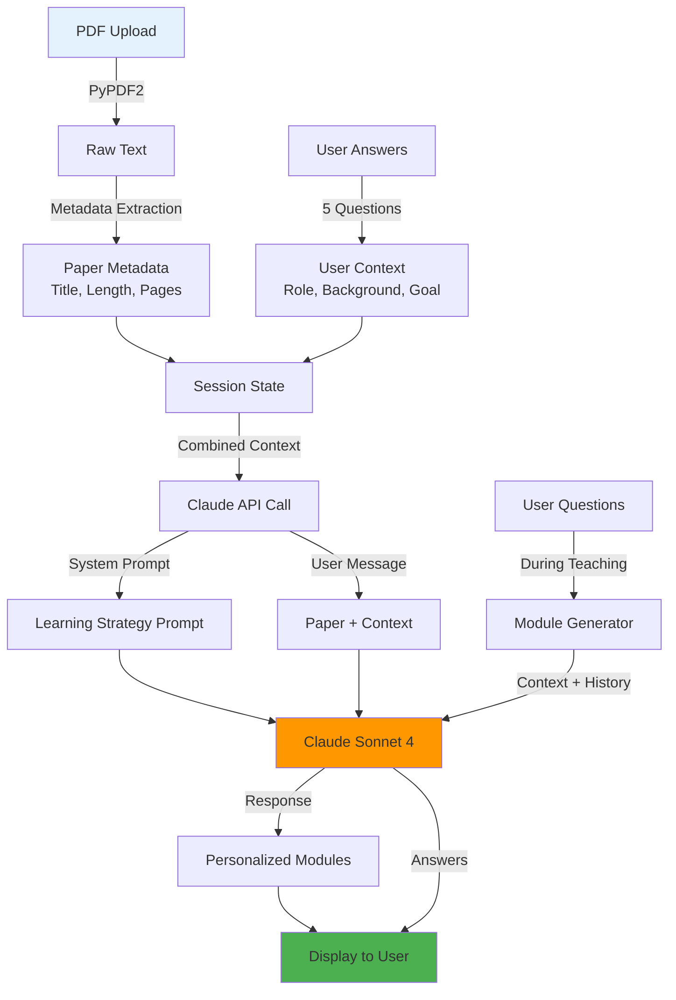
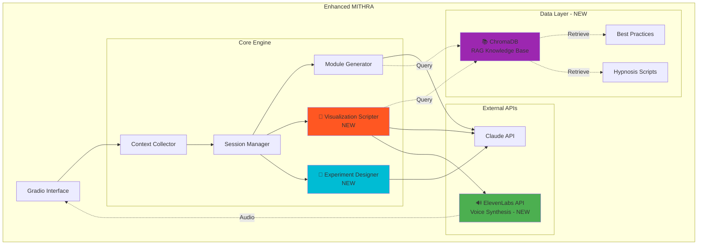

# MITHRA - System Architecture

**Machine Intelligence for Translating Human Research into Action**

---

## 🏗️ High-Level Architecture (Current MVP)



---

## 📊 Component Architecture



---

## 🔄 User Flow Diagram



---

## 🗂️ Data Flow



---

## 🧩 Module Breakdown

### **1. PDF Processor** (`utils/pdf_processor.py`)
**Purpose:** Extract text from uploaded research papers

**Key Functions:**
- `extract_text_from_pdf()` - PyPDF2 text extraction
- `get_paper_metadata()` - Extract title, word count, page estimate

**Input:** PDF file path
**Output:** Plain text + metadata dict

---

### **2. Session Manager** (`workflows/session_manager.py`)
**Purpose:** Track user progress through the learning workflow

**State Machine:**
```
INIT → PAPER_RECEIVED → COLLECTING_CONTEXT →
CONTEXT_COMPLETE → GENERATING_MODULES → TEACHING → COMPLETE
```

**Stores:**
- Paper text and metadata
- User context (5 answers)
- Generated module plan
- Conversation history

---

### **3. Context Collector** (`workflows/context_collector.py`)
**Purpose:** Gather user background and learning goals

**5 Questions:**
1. Professional role
2. Technical background
3. Learning goal
4. Time available
5. Desired depth

**Output:** User profile for personalization

---

### **4. Module Generator** (`workflows/module_generator.py`)
**Purpose:** Create and deliver personalized learning content

**Key Methods:**
- `generate_learning_plan()` - Initial module creation
- `teach_module()` - Deliver content + answer questions

**Uses:**
- System prompts from `prompts/pedagogy_prompts.py`
- User context from Session Manager
- Claude API for generation

---

### **5. Prompts** (`prompts/`)
**Purpose:** Guide AI behavior for personalization

**Files:**
- `context_prompts.py` - User intake questions
- `pedagogy_prompts.py` - Teaching strategies, module generation

**Best Practices:**
- Active learning principles
- Scaffolding (build on prior knowledge)
- Purpose-driven explanations
- Socratic questioning

---

## 🔌 External Integrations

### **Claude API (Anthropic)**
**Model:** claude-sonnet-4-20250514
**Usage:**
- Module generation (~8k tokens input, ~2k output)
- Teaching responses (~1.5k tokens output)

**Cost:** ~$0.20 per user session

**API Call Pattern:**
```python
client.messages.create(
    model=CLAUDE_MODEL,
    max_tokens=2000,
    system=SYSTEM_PROMPT,
    messages=[user_context + paper_content]
)
```

---

### **Render.com Hosting**
**Instance:** Free tier web service
**Runtime:** Python 3.10
**Port:** 10000 (auto-assigned)

**Environment Variables:**
- `ANTHROPIC_API_KEY` - Claude API access
- `PORT` - Web server port (set by Render)

**Auto-deploy:** On git push to `mithra-app` branch

---

## 📈 Future Architecture (Sprint 2-3)



---

## 🎯 Technology Stack

### **Frontend**
- **Gradio 4.44+** - Web UI framework
- **Python 3.10** - Runtime

### **Backend**
- **Anthropic SDK** - Claude API client
- **PyPDF2** - PDF text extraction
- **Python-dotenv** - Environment management

### **Infrastructure**
- **Render.com** - Cloud hosting (free tier)
- **GitHub** - Version control + CI/CD
- **Git** - Auto-deploy trigger

### **Future Additions (Planned)**
- **ChromaDB** - Vector database for RAG
- **ElevenLabs** - Voice synthesis
- **Sentence-Transformers** - Embeddings

---

## 🔒 Security Architecture

```mermaid
graph LR
    subgraph "Public"
        User[User Browser]
        URL[mithra-jerx.onrender.com]
    end

    subgraph "Render Infrastructure"
        SSL[SSL/TLS Termination]
        App[MITHRA Application]
    end

    subgraph "Secrets Management"
        Env[Environment Variables]
        API[API Keys Encrypted]
    end

    subgraph "Private"
        GitHub[Private GitHub Repo]
        Code[Source Code & Prompts]
    end

    User -->|HTTPS| URL
    URL --> SSL
    SSL --> App

    App -.->|Read| Env
    Env -.->|Decrypt| API

    GitHub -.->|Deploy| App
    Code -.->|Hidden| GitHub

    style SSL fill:#4caf50
    style Env fill:#ff9800
    style GitHub fill:#000
```



**Security Features:**
- ✅ HTTPS/TLS encryption (Render auto-provision)
- ✅ API keys in environment secrets (never in code)
- ✅ Source code private on GitHub
- ✅ No user data persistence (sessions in-memory only)
- ✅ Uploaded PDFs processed in-memory, not stored

---

## 📊 Performance Metrics

### **Current MVP**
- **Cold Start:** 30-60 seconds (free tier sleep)
- **Warm Response:** 3-5 seconds per message
- **Module Generation:** 10-20 seconds
- **Memory Usage:** ~200MB
- **Concurrent Users:** 1-2 (free tier limitation)

### **Scalability Path**
**Paid Tier ($7/mo):**
- No cold starts
- Better CPU/RAM
- 10+ concurrent users

**Future Optimizations:**
- Cache frequently accessed prompts
- Batch API calls where possible
- Implement streaming responses

---

## 🧪 Testing Strategy

### **Unit Tests** (Planned)
- PDF extraction accuracy
- State machine transitions
- Prompt template rendering

### **Integration Tests** (Planned)
- End-to-end user flow
- API error handling
- Session state persistence

### **User Testing** (Current Phase)
- 3-5 ML practitioners
- Task: Learn 1 research paper
- Metrics: Time, comprehension, satisfaction

---

## 📝 System Requirements

### **For Development:**
- Python 3.10+
- Anthropic API key
- Git
- 2GB RAM minimum

### **For Deployment:**
- Render.com account (free)
- GitHub repo (private supported)
- Environment secrets configured

### **For Users:**
- Modern web browser
- Research paper PDF (text-selectable)
- 45-75 minutes for full session

---

## 🚀 Deployment Pipeline

```mermaid
flowchart LR
    A[Local Development] -->|git commit| B[GitHub Repo<br/>mithra-app branch]
    B -->|Webhook Trigger| C[Render Build]

    C -->|1. Clone Repo| D[Install Dependencies<br/>pip install -r requirements.txt]
    D -->|2. Set Python 3.10| E[Configure Runtime]
    E -->|3. Load Secrets| F[Environment Variables]
    F -->|4. Start App| G[python main.py]

    G -->|Success| H[Live at<br/>mithra-jerx.onrender.com]
    G -->|Failure| I[Check Logs<br/>Fix & Retry]

    style A fill:#e3f2fd
    style B fill:#000
    style H fill:#4caf50
    style I fill:#f44336
```



**Build Time:** 2-3 minutes
**Auto-deploy:** On every push to `mithra-app` branch

---

## 🎓 Educational Value (Bootcamp Context)

This architecture demonstrates:

### **LLM Application Patterns**
- ✅ Prompt engineering (system + user messages)
- ✅ Context management (session state)
- ✅ Multi-turn conversations
- ✅ Personalization strategies

### **Software Engineering**
- ✅ Modular architecture (separation of concerns)
- ✅ State machines (workflow management)
- ✅ External API integration
- ✅ Environment-based configuration

### **Deployment & DevOps**
- ✅ Cloud deployment (Render.com)
- ✅ CI/CD (git-based auto-deploy)
- ✅ Secrets management
- ✅ Monitoring & logging

### **Product Development**
- ✅ MVP scoping (core features first)
- ✅ User-centered design (personalization)
- ✅ Iterative development (Sprint 1 → 2 → 3)

---

## 📅 Roadmap

### **Sprint 1 (Current)** ✅
- [x] PDF upload & processing
- [x] Context collection (5 questions)
- [x] Personalized module generation
- [x] Interactive teaching
- [x] Render deployment

### **Sprint 2 (Nov 10 Demo)**
- [ ] Add ChromaDB for RAG
- [ ] Best practices corpus (60+ documents)
- [ ] Enhanced personalization with retrieval
- [ ] Visualization script generation

### **Sprint 3 (Nov 24 Demo)**
- [ ] ElevenLabs voice integration
- [ ] Audio visualization scripts
- [ ] Experiment design guidance
- [ ] Multi-paper synthesis

### **Final (Dec 5 Demo)**
- [ ] Polish & optimization
- [ ] User study results
- [ ] Production deployment
- [ ] Documentation & handoff

---

**Built for Anthropic AI Engineering Bootcamp 2025** 🚀
