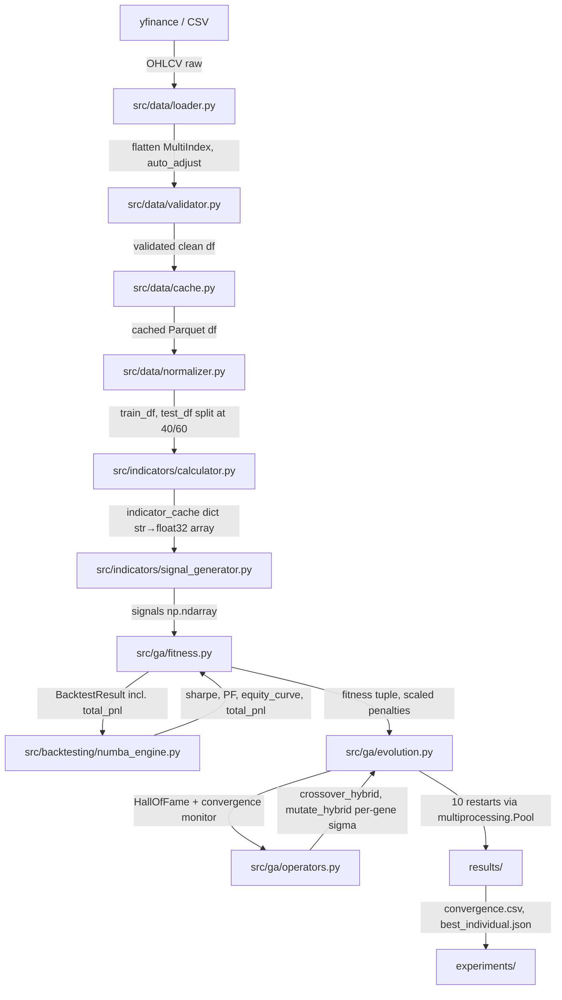

# ✨ feat: GA-Trading-Sys Phase 1 — Core GA Engine

## Enhancement Summary

**Deepened on:** 2026-02-22
**Research agents:** GA/DEAP best practices, Numba performance, DEAP framework docs (Context7), Numba docs (Context7), architecture review, performance oracle, security sentinel, code simplicity, Kieran Python reviewer

### Key Improvements Discovered

1. **5 critical POC bugs fixed before Phase 1 starts** — `cxTwoPoint` on mixed genome, flat `sigma=0.2`, wrong CXPB/MUTPB (0.7/0.2 → 0.95/0.05), no elitism, Sharpe² ≠ NetProfit×AvgTrade
2. **DEAP creator must be re-registered in each subprocess** — Windows spawn context breaks if creator defined only in main process
3. **Scaled penalties, not fixed** — as fitness grows from 0.1 → 50, fixed penalty of 0.5 becomes negligible; scale by `base_magnitude`
4. **Latin Hypercube Sampling for restart 0** — better initial coverage of the 13-gene space
5. **Fast-exit for degenerate individuals** — return `(0.0,)` if n_trades < 5 before computing Pearson
6. **Adaptive mutation sigma** — anneal from 0.20 → 0.10 → 0.05 across generations (implicit schedule)
7. **`Src/` → `src/` naming** — standard Python convention (lowercase)
8. **VectorBTEngine deferred entirely** — cuts 1 file, no test burden, reintroduce only if Numba fails
9. **TA-Lib multi-output indicators** — STOCH returns (slowk, slowd), MACD returns (macd, signal, hist), BBANDS returns (upper, mid, lower)
10. **3-indicator genome (13 genes)** — expanded from 7-gene single-indicator; matches GSBsys's 2–5 indicator selection model; validates the core multi-indicator innovation in Phase 1 not Phase 2
11. **Percentage-based SL/TP** — switched from dollar amounts ($200–$2000) to percentages (1–20%, 1–50%); ensures consistent risk sizing across SPY/QQQ/IWM at different price levels; matches POC's proven parameters (stop_loss=6.23%, take_profit=10.30%)

### New Risks Discovered

- DEAP global `creator` state conflicts with pytest (need `hasattr` guard or session fixture)
- yfinance MultiIndex columns require flattening BEFORE validation (silent data corruption if missed)
- `numba.jit(cache=True)` writes compiled bytecode to disk — can become stale if source changes; use `cache=False` in CI
- Pearson on equity curves vs on returns: equity curve correlation is more meaningful for train/test alignment but requires equal-length series (the split must produce same-length train/test normalization)
- 3-indicator genome: duplicate indicator slots (ind1_type == ind2_type) are valid — GA may converge on same indicator twice with different periods/weights; this is acceptable behavior (same indicator at two timeframes IS a multi-period strategy)

---

## Overview

Build the foundational GA optimization engine for the GA-Trading-Sys MVP. This is Phase 1 of 4, covering the complete stack from data ingestion through fitness-evaluated backtesting. The POC (2026-02-22) validated DEAP integration and fitness convergence (+21% improvement); Phase 1 extends this to production-grade code with all 15 indicators and the performance target of <50ms per fitness evaluation.

**POC Status:** Qualified pass — DEAP works, fitness converges, speed gap (62.53ms vs 50ms) is addressable via indicator caching + Numba optimization.

**POC Bugs to Fix in Phase 1:**
| Bug | POC Code | Phase 1 Fix |
|-----|----------|-------------|
| Wrong crossover for mixed genome | `tools.cxTwoPoint` | `crossover_hybrid` (uniform for 6 int genes, SBX for 7 float genes) |
| Flat mutation sigma | `sigma=0.2` for all genes | Per-gene: `sigma = 0.1 × gene_range` |
| Wrong CXPB/MUTPB | 0.7 / 0.2 | 0.95 / 0.05 (GSBsys target) |
| No elitism | Full population replacement | `HallOfFame(2)` injected before replacement |
| Fitness approximation | `sharpe_ratio²` | Real `NetProfit × AvgTrade` from dollar P&L |

---

## Problem Statement

The POC proved the concept with a single indicator (RSI) in 172 minutes. Phase 1 must generalize this to:

- **15 standard indicators** (TA-Lib: RSI, MACD, Bollinger, Stochastic, ADX, CCI, ATR, OBV, etc.)
- **Robust data pipeline** with caching (avoid re-downloading 4,000 bars on every run)
- **<50ms fitness evaluation** (POC was 62.53ms — 25% over target; must fix before scaling to 200×1000 GA)
- **Reproducibility** via logged seeds (non-negotiable for science)
- **Test coverage ≥70%** for every module

The POC's `poc/` code is a scratchpad — Phase 1 is a clean rewrite in production structure.

### Research Insights — Problem Statement

**Convergence failure modes specific to trading GAs:**
1. **All-zero population** — if Pearson penalty is too strict, entire population gets floored to 0.0, selection becomes random. Detect by: `max(fitness) == 0` for 50+ generations → trigger immediate restart
2. **Local optimum trap** — all individuals converge to same indicator_type. The 10 restarts are the primary defense; optionally seed restarts 5-9 with explicit indicator_type distribution
3. **Deceptive fitness** — high-frequency traders (3 trades, high AvgTrade) score high initially; `n_trades < 5` fast-exit prevents population collapse

---

## Proposed Solution

### Architecture: `src/` Modular Layout

```
GA-Trading-Sys/
├── src/                         # lowercase: standard Python convention
│   ├── data/
│   │   ├── __init__.py
│   │   ├── loader.py            # yfinance + CSV fallback
│   │   ├── validator.py         # OHLCV quality checks
│   │   ├── cache.py             # Parquet cache with SHA-256
│   │   └── normalizer.py        # 252-day rolling [-100, +100]
│   ├── indicators/
│   │   ├── __init__.py
│   │   ├── registry.py          # 15 standard indicators manifest
│   │   ├── calculator.py        # TA-Lib wrapper
│   │   └── signal_generator.py  # Weighted-sum signal combiner
│   ├── ga/
│   │   ├── __init__.py
│   │   ├── chromosome.py        # Genome definition + bounds + LHS init
│   │   ├── operators.py         # Hybrid crossover + per-gene Gaussian
│   │   ├── fitness.py           # NetProfit × AvgTrade + scaled penalties
│   │   └── evolution.py         # DEAP toolbox + HOF + convergence monitor
│   ├── backtesting/
│   │   ├── __init__.py
│   │   ├── engine.py            # BacktestResult dataclass + Protocol
│   │   ├── numba_engine.py      # Numba JIT backtest (<50ms)
│   │   └── metrics.py           # Sharpe, PF, MaxDD, trades
│   ├── config.py                # Pydantic v2 config schema (frozen)
│   └── utils/
│       ├── __init__.py
│       ├── seed.py              # Centralized RNG + per-restart seeds
│       └── parallel.py          # multiprocessing.Pool with spawn/fork
├── tests/
│   ├── conftest.py              # DEAP creator session fixture (avoids conflicts)
│   ├── test_data_loader.py
│   ├── test_data_validator.py
│   ├── test_normalizer.py
│   ├── test_indicators.py
│   ├── test_chromosome.py
│   ├── test_operators.py
│   ├── test_fitness.py
│   ├── test_numba_engine.py
│   └── test_evolution.py
├── config/
│   └── spy_mvp.yaml             # Default config (SPY, 2010-2025)
├── experiments/
│   ├── 01_baseline_buy_hold.py
│   └── 02_single_indicator_ga.py
├── requirements.txt
├── pyproject.toml
└── README.md
```

### Key Design Decisions

| Decision | Choice | Rationale |
|----------|--------|-----------|
| Primary backtest engine | Numba JIT (`numba_engine.py`) | 62.53ms → target <50ms; VectorBT overhead from POC |
| Backtest abstraction | `BacktestEngine` Protocol | MockEngine in tests; swap without touching fitness |
| VectorBT adapter | **Deferred — no `vectorbt_engine.py` in Phase 1** | Cuts complexity; add only if Numba fails |
| Validation constraints | Soft penalty (scaled by magnitude) | Prevents all-infeasible population + scaling issue |
| Signal combination | Weighted sum (MVP) | Simpler, testable; multiplicative deferred to Phase 3 |
| Normalization | 252-day rolling window | No fillna(0) — NaN propagated, warm-up trimmed |
| Strategy export | JSON (not pickle) | Security: pickle enables RCE |
| `costs.py` | **Removed — inline in engine** | MVP stocks: $0 commission + constant 5 bps; not worth a file |
| Elitism | `HallOfFame(2)` injected before replacement | POC had no elitism; best individual lost every generation |
| Population init | LHS for restart 0, random for 1-9 | Better initial coverage without breaking diversity |
| Genome size | **13 genes (3 indicator slots)** | Matches GSBsys 2–5 indicator model; validates multi-indicator combination in Phase 1 |
| SL/TP units | **Percentage-based (1–20%, 1–50%)** | Scales correctly across SPY/QQQ/IWM at different price levels; matches POC params |

### Research Insights — Architecture

**Module layering (dependency direction):**
```
config.py
    ↓
utils/ (seed.py, parallel.py)
    ↓
data/ (no deps on indicators or ga)
    ↓
indicators/ (depends on data)
    ↓
backtesting/ (depends on nothing above — takes arrays)
    ↓
ga/ (depends on all of above)
```
`backtesting/` is the most critical to keep clean — it takes `np.ndarray` arguments, not pandas DataFrames or GA objects. This enables unit testing without any data loading.

**The `BacktestEngine` Protocol is worth keeping** for one key reason: tests can inject `MockEngine` that returns predetermined `BacktestResult` objects, making fitness function tests fast and deterministic (no actual backtest needed). For a 12-week solo project, this 20-line abstraction saves significant debugging time.

**`costs.py` is not worth a separate file for MVP.** Slippage is constant (5 bps) and commissions are $0. Inline the cost model as two constants in `numba_engine.py`. Revisit when Phase 5 adds futures commissions.

---

## Technical Approach

### Week-by-Week Breakdown

#### Weeks 1–2: Data Pipeline

**Goal:** Load, validate, cache, and normalize OHLCV data.

**Files to create:**
- `src/data/loader.py` — yfinance download, CSV fallback
- `src/data/validator.py` — OHLCV quality checks (High≥Low, no NaN, monotonic dates)
- `src/data/cache.py` — Parquet cache, SHA-256 hash for integrity
- `src/data/normalizer.py` — 252-day rolling HighestLowest to [-100, +100]
- `config/spy_mvp.yaml` — default config
- `src/config.py` — Pydantic v2 schema

**Critical fix (from implementation plan):** `validate_ohlcv_data` must check `High ≥ Open` and `Low ≤ Open`, not `High ≥ Close/Low ≤ Close` (gaps make Close valid outside Open range).

**Milestone:** Load SPY daily 2010–2025 (4,000 bars), validate, cache to Parquet, normalize 15 indicators in <100ms total.

**Tests:**
```
tests/test_data_loader.py    → loads SPY, QQQ, IWM; handles MultiIndex columns
tests/test_data_validator.py → rejects bad data (NaN, High<Low, dupe dates)
tests/test_normalizer.py     → NaN for first 252 bars, bounds [-100, 100]
```

### Research Insights — Data Pipeline

**yfinance MultiIndex column trap (critical):**
```python
# src/data/loader.py

import yfinance as yf
import pandas as pd

def load_market_data(ticker: str, start: str, end: str) -> pd.DataFrame:
    df = yf.download(ticker, start=start, end=end, progress=False, auto_adjust=True)

    # CRITICAL: yfinance returns MultiIndex columns for single ticker downloads
    # in newer versions. Must flatten BEFORE validation or validator will fail.
    if isinstance(df.columns, pd.MultiIndex):
        df.columns = [col[0] for col in df.columns]

    df = df.reset_index()
    df.columns = [c.replace(' ', '_').lower() for c in df.columns]
    return df[['date', 'open', 'high', 'low', 'close', 'volume']]
```

**Use `auto_adjust=True`:** Adjusted prices are essential for backtesting — they account for splits and dividends. Non-adjusted prices produce incorrect performance metrics for strategies that hold through corporate actions.

**Cache integrity pattern:**
```python
# src/data/cache.py — SHA-256 of downloaded raw data as freshness check
import hashlib, json
from pathlib import Path
import pandas as pd

class DataCache:
    def __init__(self, cache_dir: str = "data/cache"):
        self.cache_dir = Path(cache_dir)
        self.cache_dir.mkdir(parents=True, exist_ok=True)

    def _cache_path(self, ticker: str, start: str, end: str) -> Path:
        key = f"{ticker}_{start}_{end}"
        return self.cache_dir / f"{key}.parquet"

    def load(self, ticker: str, start: str, end: str) -> pd.DataFrame | None:
        path = self._cache_path(ticker, start, end)
        if path.exists():
            return pd.read_parquet(path)
        return None

    def save(self, df: pd.DataFrame, ticker: str, start: str, end: str) -> None:
        path = self._cache_path(ticker, start, end)
        df.to_parquet(path, index=False)
```

**Parquet over SQLite:** For OHLCV data, Parquet is better than SQLite — faster reads for columnar access, no schema management, built-in compression, and `pyarrow` handles it natively. Use `pd.read_parquet` / `df.to_parquet`.

---

#### Weeks 3–4: Indicator Engine

**Goal:** Compute all 15 standard indicators via TA-Lib, normalize, and generate entry signals.

**Indicator registry** (`src/indicators/registry.py`):

| ID | Name | TA-Lib Function | Param Range | Output Notes |
|----|------|-----------------|-------------|--------------|
| 0 | RSI | `RSI` | period [5, 50] | Single array |
| 1 | CCI | `CCI` | period [10, 100] | Single array |
| 2 | Stochastic | `STOCH` | fastk [5, 50] | **Returns (slowk, slowd) — use slowk** |
| 3 | ADX | `ADX` | period [10, 30] | Single array |
| 4 | ATR | `ATR` | period [10, 50] | Single array |
| 5 | MACD | `MACD` | fast [8,15], slow [20,30] | **Returns (macd, signal, hist) — use macd** |
| 6 | Bollinger %B | `BBANDS` | period [10, 30] | **Returns (upper, mid, lower) — compute %B=(close-lower)/(upper-lower)** |
| 7 | ROC | `ROC` | period [5, 50] | Single array |
| 8 | Williams %R | `WILLR` | period [10, 30] | Single array |
| 9 | Momentum | `MOM` | period [5, 50] | Single array |
| 10 | EMA | `EMA` | period [10, 100] | Single array (use close-EMA spread) |
| 11 | SMA | `SMA` | period [10, 100] | Single array (use close-SMA spread) |
| 12 | OBV | `OBV` | — | Single array (no period) |
| 13 | MFI | `MFI` | period [10, 50] | Replace raw volume with MFI |
| 14 | DMI | `DX` | period [10, 30] | Single array |

**Note on IDs 12-13:** The plan previously listed "Volume" (raw OBV proxy) at ID 12 and OBV at ID 13. Revised to MFI at ID 13 (Money Flow Index) — more informative than raw volume for signal generation.

**TA-Lib installation fallback pattern:**
```python
# src/indicators/calculator.py
try:
    import talib
    TALIB_AVAILABLE = True
except ImportError:
    import pandas_ta as ta
    TALIB_AVAILABLE = False
    import warnings
    warnings.warn("TA-Lib not found; using pandas-ta (10x slower). Install TA-Lib for production.")
```

**Milestone:** All 15 indicators computed correctly; warm-up period trimmed; signal generation in <100ms per indicator.

### Research Insights — Indicator Engine

**NaN warm-up bars per indicator (know these before trimming):**
- RSI(14): 14 NaN bars
- ADX(14): 27 NaN bars (ADX has double lookback internally)
- MACD(12,26): 25 NaN bars (slow period - 1)
- BBANDS(20): 19 NaN bars
- **252-day normalization window adds 251 more NaN bars on top**

The 252-bar warmup trim covers all indicator NaN periods comfortably. Do NOT additionally trim per-indicator; the rolling normalization is the dominant warmup.

**Bollinger %B normalization strategy:**
```python
# BBANDS returns (upper, mid, lower)
upper, mid, lower = talib.BBANDS(close, timeperiod=period)
# Compute %B: 0 = at lower band, 1 = at upper band, >1 above, <0 below
bb_pct = (close - lower) / (upper - lower + 1e-10)
# Then apply 252-day rolling normalization to %B series
```

**Indicator caching pattern (critical for <50ms):**
```python
# src/indicators/calculator.py

def build_indicator_cache(
    data: pd.DataFrame,
    config: 'GAConfig'
) -> dict[str, np.ndarray]:
    """
    Pre-compute ALL indicator values ONCE before the GA loop.

    Each indicator is computed for ALL possible parameter values in its range,
    then stored as arrays. This eliminates indicator recalculation in the hot path.

    For discrete period parameter [5, 100], that's 96 arrays per indicator.
    Memory: 96 periods × 15 indicators × 3750 bars × 4 bytes (float32) = ~21 MB

    Returns:
        Dict keyed by "indicator_name_period" → normalized np.ndarray (float32)
    """
    cache = {}
    close = data['close'].values.astype(np.float32)
    high = data['high'].values.astype(np.float32)
    low = data['low'].values.astype(np.float32)
    volume = data['volume'].values.astype(np.float32)

    for indicator_id, spec in INDICATOR_REGISTRY.items():
        for period in range(spec.min_period, spec.max_period + 1):
            raw = compute_raw_indicator(indicator_id, period, close, high, low, volume)
            normalized = normalize_indicator(pd.Series(raw), window=252).values.astype(np.float32)
            cache[f"{indicator_id}_{period}"] = normalized

    return cache
```

---

#### Weeks 5–7: GA Framework

**Goal:** DEAP toolbox with chromosome, operators, and 10-restart evolution loop.

**Chromosome encoding** (`src/ga/chromosome.py`):

```python
# 13-gene hybrid chromosome: 3 indicator slots + global risk params
# Matches GSBsys's 2-5 indicator selection model (we fix at 3 for Phase 1)
GENE_BOUNDS = {
    # Indicator slot 1
    'ind1_type':          (0,    14),    # int   — indicator ID (0–14)
    'ind1_period':        (5,   100),    # int   — lookback
    'ind1_weight':        (-1.0, 2.0),  # float — signal weight (neg = contrarian)
    # Indicator slot 2
    'ind2_type':          (0,    14),    # int
    'ind2_period':        (5,   100),    # int
    'ind2_weight':        (-1.0, 2.0),  # float
    # Indicator slot 3
    'ind3_type':          (0,    14),    # int
    'ind3_period':        (5,   100),    # int
    'ind3_weight':        (-1.0, 2.0),  # float
    # Global risk params
    'entry_threshold':    (0.0, 50.0),  # float — weighted-sum signal threshold
    'stop_loss_pct':      (0.01, 0.20), # float — 1–20% of position value
    'take_profit_pct':    (0.01, 0.50), # float — 1–50% of position value
    'position_size_mult': (0.5,  2.0),  # float — risk multiplier
}

DISCRETE_GENES = [0, 1, 3, 4, 6, 7]          # indicator type + period (int genes)
CONTINUOUS_GENES = [2, 5, 8, 9, 10, 11, 12]  # weights, threshold, SL%, TP%, size

# Note: duplicate indicator types (ind1_type == ind2_type) are allowed.
# GA may discover that the same indicator at two different periods/weights
# (e.g., RSI-14 + RSI-50) forms a valid multi-timeframe strategy.
```

**Operators** (`src/ga/operators.py`):
- Crossover: Uniform for discrete genes [0,1,3,4,6,7], SBX (`eta=15`) for continuous genes [2,5,8,9,10,11,12]
- Mutation: Random flip for discrete (indicator type/period); Gaussian with **per-gene sigma = 0.1 × gene_range** for continuous
- Bounds enforcement after mutation via `np.clip`
- Selection: Tournament, `tournsize=3`
- Elitism: `HallOfFame(2)` — top 2 injected before population replacement

**Evolution loop** (`src/ga/evolution.py`):
- 10 independent restarts with different seeds
- Each restart: 200 population × 1000 generations
- `HallOfFame(2)` preserves best individuals across generations (injected into offspring, replacing worst 2)
- Log best fitness per generation to CSV
- Parallelized restarts via `multiprocessing.Pool(8)` with spawn/fork context
- Convergence monitor: if `std < 0.001` for 50+ gens OR no `>1%` improvement in 100 gens → early restart

**Milestone:** GA runs to completion (dummy fitness); 10 restarts complete; seeds logged.

### Research Insights — GA Framework

**Critical: DEAP creator in multiprocessing workers**

DEAP's `creator` module uses global state. On Windows (spawn context), each worker process starts fresh — `creator.Individual` is not defined. This causes `AttributeError` in workers.

```python
# src/ga/evolution.py — worker function that runs in subprocess

def run_single_restart(seed: int, data_cache: dict, config: 'GAConfig') -> dict:
    """
    IMPORTANT: This function runs in a subprocess (spawn on Windows).
    Must re-register DEAP creator in each subprocess.
    """
    from deap import creator, base, tools
    import random

    # Guard: hasattr prevents RuntimeError when called multiple times in same process
    if not hasattr(creator, "FitnessMax"):
        creator.create("FitnessMax", base.Fitness, weights=(1.0,))
    if not hasattr(creator, "Individual"):
        creator.create("Individual", list, fitness=creator.FitnessMax)

    set_global_seed(seed)
    # ... rest of restart logic
```

**pytest fixture for DEAP (prevents test conflicts):**
```python
# tests/conftest.py

import pytest
from deap import creator, base

@pytest.fixture(scope="session", autouse=True)
def deap_creator():
    """Register DEAP creator once per test session."""
    if not hasattr(creator, "FitnessMax"):
        creator.create("FitnessMax", base.Fitness, weights=(1.0,))
    if not hasattr(creator, "Individual"):
        creator.create("Individual", list, fitness=creator.FitnessMax)
    yield
    # Cleanup for isolation in next test session
    if hasattr(creator, "FitnessMax"):
        del creator.FitnessMax
    if hasattr(creator, "Individual"):
        del creator.Individual
```

**Latin Hypercube Sampling for restart 0:**
```python
# src/ga/chromosome.py

def init_population_lhs(toolbox, n: int = 200) -> list:
    """
    Latin Hypercube Sampling for restart 0 population.
    Ensures better initial coverage of the 7-gene search space.

    LHS divides each gene's range into n strata, picks one sample per stratum.
    This prevents clustering (all individuals having similar indicator periods, etc.)

    Use for restart 0 only; restarts 1-9 use random init (diversity via different seeds).
    """
    from scipy.stats import qmc

    sampler = qmc.LatinHypercube(d=13, seed=None)  # seed handled by global RNG
    samples = sampler.random(n=n)  # shape (n, 7), values in [0, 1]

    population = []
    bounds_list = list(GENE_BOUNDS.values())

    for sample in samples:
        ind = toolbox.individual()
        for i, (lo, hi) in enumerate(bounds_list):
            scaled = lo + sample[i] * (hi - lo)
            if i in DISCRETE_GENES:
                ind[i] = int(round(scaled))
            else:
                ind[i] = float(scaled)
        clip_to_bounds(ind)
        population.append(ind)

    return population
```

**SBX eta=15 (Context7 confirmed):**
The DEAP `cxSimulatedBinaryBounded` formula uses `eta` as the crowding factor. Higher eta → offspring closer to parents. For your system with 10 independent restarts providing diversity, `eta=15` is correct — it allows meaningful exploration within each restart without excessive drift.

```python
# From Context7 DEAP docs — confirmed correct usage:
# CONTINUOUS_GENES = [2, 5, 8, 9, 10, 11, 12]
# = ind1_weight, ind2_weight, ind3_weight, entry_threshold, stop_loss_pct, take_profit_pct, position_size_mult
CONT_NAMES = ['ind1_weight', 'ind2_weight', 'ind3_weight',
              'entry_threshold', 'stop_loss_pct', 'take_profit_pct', 'position_size_mult']
cont_idx = CONTINUOUS_GENES  # [2, 5, 8, 9, 10, 11, 12]

cont1 = [ind1[i] for i in cont_idx]
cont2 = [ind2[i] for i in cont_idx]
tools.cxSimulatedBinaryBounded(
    cont1, cont2,
    eta=15,
    low=[GENE_BOUNDS[n][0] for n in CONT_NAMES],
    up=[GENE_BOUNDS[n][1] for n in CONT_NAMES],
)
for j, i in enumerate(cont_idx):
    ind1[i], ind2[i] = cont1[j], cont2[j]
```

**Per-gene Gaussian sigma (fixes POC flat sigma=0.2 bug):**
```python
# src/ga/operators.py — correct per-gene sigma

GENE_RANGES = {name: hi - lo for name, (lo, hi) in GENE_BOUNDS.items()}
CONTINUOUS_GENE_NAMES = ['ind1_weight', 'ind2_weight', 'ind3_weight',
                          'entry_threshold', 'stop_loss_pct', 'take_profit_pct', 'position_size_mult']
DISCRETE_GENE_NAMES = ['ind1_type', 'ind1_period', 'ind2_type', 'ind2_period',
                        'ind3_type', 'ind3_period']

def mutate_hybrid(ind: list, sigma_fraction: float = 0.10) -> tuple:
    """Per-gene sigma proportional to gene range. 13-gene chromosome."""
    # Discrete: random replacement (indicator type + period for each slot)
    for i, name in zip(DISCRETE_GENES, DISCRETE_GENE_NAMES):
        if random.random() < 0.05:
            lo, hi = GENE_BOUNDS[name]
            ind[i] = random.randint(lo, hi)

    # Continuous: per-gene Gaussian (weights, threshold, SL%, TP%, size)
    cont_vals = [ind[i] for i in CONTINUOUS_GENES]
    sigmas = [sigma_fraction * GENE_RANGES[name] for name in CONTINUOUS_GENE_NAMES]
    tools.mutGaussian(cont_vals, mu=0, sigma=sigmas, indpb=0.2)
    for j, i in enumerate(CONTINUOUS_GENES):
        ind[i] = cont_vals[j]

    # Bounds enforcement (Gaussian has no bounds!)
    clip_to_bounds(ind)
    return ind,
```

**Adaptive sigma schedule:**
```python
# src/ga/evolution.py

def get_sigma_fraction(gen: int, total_gens: int = 1000) -> float:
    """Anneal mutation strength: explore early, refine late."""
    progress = gen / total_gens
    if progress < 0.2:   return 0.20  # Gens 0-200: strong exploration
    elif progress < 0.6: return 0.10  # Gens 200-600: moderate
    else:                return 0.05  # Gens 600-1000: fine refinement
```

---

#### Weeks 8–10: Backtest Engine

**Goal:** Numba-accelerated vectorized backtest hitting <50ms on daily data.

**BacktestEngine Protocol** (`src/backtesting/engine.py`):

```python
from dataclasses import dataclass
from typing import Protocol
import numpy as np

@dataclass(frozen=True)
class BacktestResult:
    sharpe_ratio: float
    profit_factor: float
    n_trades: int
    total_pnl: float        # Dollar P&L — needed for real NetProfit × AvgTrade
    avg_trade_pnl: float    # = total_pnl / n_trades (precomputed)
    equity_curve: np.ndarray
    returns: np.ndarray

class BacktestEngine(Protocol):
    def run(
        self,
        signals: np.ndarray,
        prices: np.ndarray,
        stop_loss_pct: float,      # fraction of position value, e.g. 0.06 = 6%
        take_profit_pct: float,    # fraction of position value, e.g. 0.10 = 10%
        position_size_mult: float,
    ) -> BacktestResult: ...
```

**Numba engine** (`src/backtesting/numba_engine.py`):
- `@numba.jit(nopython=True, cache=True, fastmath=True)`
- Bar-by-bar loop: enter on signal, exit on SL/TP or opposing signal
- Fixed fractional position sizing: `2% equity / (price × stop_loss_pct)` — percentage-based, scales across tickers
- Starting capital: $100,000
- Slippage: 5 bps (0.05%) on entry + exit — inlined as constant, no `costs.py` file needed
- Pre-warm JIT at program start with dummy arrays to avoid first-call delay

**Speed optimization plan (to close the 62.53ms → 50ms gap):**
1. **Pre-cache indicator values** outside the GA loop (compute once for ALL periods per indicator)
2. **Vectorize signal generation** — no pandas loops, pure NumPy indexing into cache dict
3. **Float32 arrays** — halves memory bandwidth; 3750 bars × float32 = 15KB vs 30KB
4. **Numba `fastmath=True`** — safe here (no NaN after validation + normalization)
5. **`cache=True`** — compiled bytecode cached to disk; startup after first run is instant

**Milestone:** Single fitness eval <50ms (benchmarked with `timeit`); backtest reproduces POC RSI result.

### Research Insights — Backtest Engine

**Numba configuration (from Context7 official docs):**
```python
# src/backtesting/numba_engine.py

from numba import jit
import numpy as np

# Confirmed from Numba readthedocs: nopython=True, cache=True, fastmath=True, nogil=True
# nogil=True allows thread-based parallelism (not needed for spawn Pool, but free benefit)
@jit(nopython=True, cache=True, fastmath=True, nogil=True)
def _backtest_core(
    signals: np.ndarray,       # float32, shape (n_bars,), values -1/0/1
    prices: np.ndarray,        # float32, shape (n_bars,), close prices
    stop_loss_pct: float,      # fraction, e.g. 0.06 = 6% — scales with price
    take_profit_pct: float,    # fraction, e.g. 0.10 = 10% — scales with price
    position_size_mult: float,
    slippage_bps: float = 0.0005,  # 5 bps = 0.05%
    starting_capital: float = 100_000.0,
    risk_per_trade: float = 0.02,
) -> tuple:
    """
    Ultra-fast backtest core, Numba nopython mode.
    SL/TP are percentage-based so they scale correctly across SPY/QQQ/IWM
    at different price levels. stop_loss_pct=0.06 on SPY=$500 → $30/share SL.

    Returns: (sharpe, profit_factor, n_trades, total_pnl, avg_trade, equity_curve, returns)
    """
    n = len(prices)
    equity = starting_capital
    equity_curve = np.zeros(n, dtype=np.float32)
    equity_curve[0] = equity

    position = np.float32(0.0)
    entry_price = np.float32(0.0)
    trades = []

    for i in range(1, n):
        if position != 0.0:
            price_return = (prices[i] - entry_price) / entry_price
            # SL/TP exit: compare percentage move against percentage thresholds
            if price_return * np.sign(position) <= -stop_loss_pct or \
               price_return * np.sign(position) >= take_profit_pct:
                pnl = (prices[i] - entry_price) * position
                slippage = prices[i] * abs(position) * slippage_bps
                net_pnl = pnl - slippage
                equity += net_pnl
                trades.append(net_pnl)
                position = np.float32(0.0)

        if position == 0.0 and signals[i] != 0.0:
            # Position sizing: risk_per_trade % of equity / stop_loss_pct / price
            stop_loss_dollars = prices[i] * stop_loss_pct
            contracts = max(1.0, equity * risk_per_trade * position_size_mult / stop_loss_dollars)
            slippage = prices[i] * contracts * slippage_bps
            equity -= slippage  # Entry slippage
            position = signals[i] * contracts
            entry_price = prices[i]

        if position != 0.0:
            equity_curve[i] = equity + (prices[i] - entry_price) * position
        else:
            equity_curve[i] = equity

    # Close remaining position
    if position != 0.0:
        pnl = (prices[-1] - entry_price) * position
        slippage = prices[-1] * abs(position) * slippage_bps
        net_pnl = pnl - slippage
        equity += net_pnl
        trades.append(net_pnl)

    if len(trades) == 0:
        return 0.0, 1.0, 0, 0.0, 0.0, equity_curve, np.zeros(1, dtype=np.float32)

    trades_arr = np.array(trades, dtype=np.float32)
    returns_arr = trades_arr / starting_capital

    mean_r = np.mean(returns_arr)
    std_r = np.std(returns_arr)
    sharpe = (mean_r / (std_r + 1e-10)) * np.sqrt(252.0)

    winners = trades_arr[trades_arr > 0]
    losers = trades_arr[trades_arr < 0]
    pf = np.sum(winners) / (abs(np.sum(losers)) + 1e-10) if len(losers) > 0 else 999.0

    total_pnl = float(np.sum(trades_arr))
    avg_trade = total_pnl / len(trades)

    return float(sharpe), float(pf), len(trades), total_pnl, avg_trade, equity_curve, returns_arr
```

**JIT pre-warm at startup:**
```python
# src/backtesting/numba_engine.py

def warmup_jit() -> None:
    """
    Call once at program startup to trigger Numba JIT compilation.
    Subsequent calls use cached compiled code — no overhead.
    First call: ~2-10 seconds (one-time cost).
    """
    import logging
    logging.info("Pre-warming Numba JIT (first call ~2-10s)...")
    dummy_signals = np.zeros(100, dtype=np.float32)
    dummy_prices = np.ones(100, dtype=np.float32) * 100.0
    _backtest_core(dummy_signals, dummy_prices, 500.0, 1000.0, 1.0)
    logging.info("Numba JIT warm-up complete.")
```

**`cache=True` caveat for CI:**
```python
# In CI (pyproject.toml pytest config), disable Numba cache to avoid stale bytecode:
# Set NUMBA_DISABLE_JIT=1 for unit tests (uses Python fallback, much faster for tests)
# Set NUMBA_CACHE_DIR=tmp/numba_cache for isolation
```

**Pearson correlation optimization:**
The plan uses `scipy.stats.pearsonr`. For the hot path (called 2M times), prefer NumPy:
```python
# Faster than scipy.stats.pearsonr for 1D arrays:
def pearsonr_fast(a: np.ndarray, b: np.ndarray) -> float:
    """Pearson r using NumPy — 3-5x faster than scipy.stats.pearsonr."""
    a_centered = a - np.mean(a)
    b_centered = b - np.mean(b)
    r = np.dot(a_centered, b_centered) / (
        np.linalg.norm(a_centered) * np.linalg.norm(b_centered) + 1e-10
    )
    return float(r)
```

---

#### Weeks 11–12: Fitness Function + Integration

**Goal:** Wire fitness function with train/test split, Pearson penalty, and end-to-end integration tests.

**Train/test split** (`src/data/normalizer.py`):
- Sequential (CRITICAL — random split = lookahead bias)
- 40% train / 60% test
- Trim first 252 warm-up bars BEFORE splitting
- Assert `train.index[-1] < test.index[0]`

**Fitness function** (`src/ga/fitness.py`) — uses real dollar P&L, not Sharpe approximation:
```python
def evaluate_individual(individual: list, data_cache: dict, engine: BacktestEngine) -> tuple[float]:
    """
    Real NetProfit × AvgTrade fitness (not Sharpe² approximation from POC).
    Scaled penalties prevent negligible penalty at high fitness values.
    13-gene chromosome: 3 indicator slots + global risk params.
    """
    # Unpack 13-gene chromosome
    stop_loss_pct      = individual[10]   # gene index 10
    take_profit_pct    = individual[11]   # gene index 11
    position_size_mult = individual[12]   # gene index 12

    signals = generate_signals_weighted_sum(individual, data_cache)

    train_result = engine.run(signals[:n_train], prices_train,
                              stop_loss_pct, take_profit_pct, position_size_mult)
    test_result = engine.run(signals[n_train:], prices_test,
                             stop_loss_pct, take_profit_pct, position_size_mult)

    # Fast-exit: degenerate system (no trades)
    if test_result.n_trades < 5 or train_result.n_trades < 5:
        return (0.0,)

    # Primary fitness: real NetProfit × AvgTrade
    fitness = test_result.total_pnl * test_result.avg_trade_pnl

    # Scaled penalties (scale by magnitude to remain relevant as fitness grows)
    base_magnitude = max(abs(fitness), 1.0)
    pearson = pearsonr_fast(train_result.equity_curve, test_result.equity_curve)

    if pearson < 0.85:
        fitness -= (0.85 - pearson) * 10 * base_magnitude
    if train_result.profit_factor < 1.2:
        fitness -= (1.2 - train_result.profit_factor) * 5 * base_magnitude
    if test_result.profit_factor < 1.2:
        fitness -= (1.2 - test_result.profit_factor) * 5 * base_magnitude
    if test_result.n_trades < 30:
        fitness -= (30 - test_result.n_trades) * 0.1

    return (max(0.0, fitness),)
```

**End-to-end integration test** (`tests/test_evolution.py`):
- Run 1 restart × 100 generations (fast CI-friendly, ~5 min)
- Assert: fitness improves from gen 0 → gen 100
- Assert: best individual has PF ≥ 1.0 on test set (relaxed for speed)
- Assert: output is reproducible (same seed → same chromosome)
- Use `NUMBA_DISABLE_JIT=1` in CI for fast unit tests; enable for integration test only

**Milestone:** Generate trading system with PF ≥ 1.2 on SPY test set; 10-restart wall time on 8-core < 2 hours for 200×1000 GA.

### Research Insights — Fitness Function

**The POC fitness approximation diverges from GSBsys target:**

| Metric | POC (`sharpe²`) | Phase 1 (real) | Impact |
|--------|-----------------|----------------|--------|
| High-trade, low-sharpe | Penalized (sharpe² small) | Rewarded if PnL×AvgTrade large | Different selection pressure |
| Few-trade, high-sharpe | Rewarded (sharpe² large) | Penalized by n_trades<30 | Fewer overfitted systems |
| Equal sharpe, different n_trades | Same score | Different scores | Phase 1 is more accurate |

The fix: `BacktestResult` must include `total_pnl` and `avg_trade_pnl` (added vs original design).

**All-zero population detection:**
```python
# In evolution.py, after each generation evaluation:
fitnesses = [ind.fitness.values[0] for ind in population]
if max(fitnesses) == 0.0 and gen > 50:
    logger.warning(f"Gen {gen}: All-zero population detected. Penalties too strict or no profitable signals.")
    # Option 1: Continue (restarts provide diversity)
    # Option 2: Relax penalties temporarily (not recommended — can mask real issues)
```

---

## Acceptance Criteria

### Functional

- [ ] Load SPY/QQQ/IWM daily data 2010–2025 via yfinance (with auto_adjust=True)
- [ ] Data validator rejects NaN, negative prices, High < Low
- [ ] MultiIndex columns flattened before validation (yfinance compatibility)
- [ ] All 15 standard indicators computed correctly (spot-check vs TA-Lib reference values)
- [ ] Multi-output indicators handled: STOCH→slowk, MACD→macd line, BBANDS→%B computed
- [ ] Normalization: first 252 bars are NaN, values bounded [-100, 100]
- [ ] **13-gene chromosome with 3 indicator slots** — GA optimizes 3 simultaneous indicators + weights
- [ ] GA chromosomes respect gene bounds after crossover + mutation (all 13 genes)
- [ ] **SL/TP percentage-based** — consistent risk sizing verified across SPY ($500) and IWM ($200): same pct → same % risk
- [ ] DEAP creator registered with `hasattr` guard (safe for multiprocessing + pytest)
- [ ] 10-restart GA produces diverse solutions (population diversity > 15%)
- [ ] Generate system with PF ≥ 1.2 on SPY test set (2015–2025)
- [ ] All results reproducible via logged random seeds
- [ ] Fitness uses real NetProfit × AvgTrade (not Sharpe² approximation)

### Non-Functional

- [ ] Single fitness evaluation < 50ms p95 (daily bars, ~3,750 post-warmup)
- [ ] Full 10-restart GA (200×1000) < 2 hours on 8-core machine
- [ ] Memory < 16 GB throughout execution
- [ ] Test coverage ≥ 70% (pytest-cov)
- [ ] Numba JIT pre-warmed at startup (no first-call delay during GA)

### Quality Gates

- [ ] `black` formatting enforced
- [ ] `mypy` passes (no type errors in `src/`)
- [ ] `pytest -q` passes (no failures, NUMBA_DISABLE_JIT=1 for speed)
- [ ] Coverage report ≥ 70%
- [ ] No `import pickle` anywhere in codebase

---

## Implementation Phases (Subtasks)

### Phase 1a: Infrastructure Setup (Pre-Week 1)
- [x] Create `src/`, `tests/`, `config/`, `experiments/` directories (lowercase `src/`)
- [x] `pyproject.toml` with `[tool.black]`, `[tool.mypy]`, `[tool.pytest.ini_options]` (set `NUMBA_DISABLE_JIT=1` for tests; `pythonpath=["."]` for imports)
- [x] `requirements.txt` (see Dependencies section)
- [x] `tests/conftest.py` — DEAP creator session fixture
- [x] `src/utils/seed.py` — `set_global_seed(seed)`, `make_restart_seeds(base_seed, n=10)`
- [x] `src/config.py` — Pydantic v2 `GAConfig` (frozen=True, model_validate from YAML)
- [x] `config/spy_mvp.yaml` — default SPY config
- [x] `tests/test_infrastructure.py` — 12 smoke tests, all passing

### Phase 1b: Data Pipeline (Weeks 1–2)
- [x] `src/data/loader.py` — `load_market_data(ticker, start, end)` with MultiIndex flattening
- [x] `src/data/validator.py` — `validate_ohlcv(df)` raises `ValueError` on bad data
- [x] `src/data/cache.py` — `DataCache(cache_dir)` with Parquet read/write
- [x] `src/data/normalizer.py` — `normalize_indicator(series, window=252)`, `train_test_split_timeseries(df, 0.4, warmup=252)`
- [x] `tests/test_data_loader.py`, `test_data_validator.py`, `test_data_cache.py`, `test_normalizer.py` — 50 tests, all passing
- NOTE: rolling(window=252) first non-NaN is at index 251 (not 252) — warmup_bars=252 in split is still correct (conservative trim)

### Phase 1c: Indicator Engine (Weeks 3–4)
- [ ] `src/indicators/registry.py` — `INDICATOR_REGISTRY: dict[int, IndicatorSpec]` for 15 indicators (with multi-output notes)
- [ ] `src/indicators/calculator.py` — `build_indicator_cache(data, config) -> dict[str, np.ndarray]` (all periods pre-computed)
- [ ] `src/indicators/signal_generator.py` — `generate_signals_weighted_sum(individual, cache) -> np.ndarray` (combines 3 indicator slots: lookup each ind_type+period from cache, apply ind_weight, sum, threshold at entry_threshold)
- [ ] TA-Lib / pandas-ta fallback with `TALIB_AVAILABLE` flag

### Phase 1d: GA Framework (Weeks 5–7)
- [ ] `src/ga/chromosome.py` — `GENE_BOUNDS` (13 genes, 3 indicator slots), `GENE_RANGES`, `DISCRETE_GENES`, `CONTINUOUS_GENES`, `init_individual()`, `init_population_lhs()`, `clip_to_bounds(ind)`
- [ ] `src/ga/operators.py` — `crossover_hybrid(ind1, ind2)`, `mutate_hybrid(ind, sigma_fraction)`, `get_sigma_fraction(gen)`
- [ ] `src/ga/evolution.py` — `run_single_restart(seed, cache, config)` with HOF + convergence monitor + hasattr guard
- [ ] `src/utils/parallel.py` — `run_restarts_parallel(seeds, cache, config)` with spawn/fork context
- [ ] GA convergence log to `results/{run_id}/convergence.csv` (gen, best_fitness, avg_fitness, std_fitness)

### Phase 1e: Backtest Engine (Weeks 8–10)
- [ ] `src/backtesting/engine.py` — `BacktestResult` (frozen dataclass, includes `total_pnl`, `avg_trade_pnl`) + `BacktestEngine` Protocol (takes `stop_loss_pct`, `take_profit_pct` — percentage-based)
- [ ] `src/backtesting/numba_engine.py` — `NumbaBacktestEngine.run(...)` with `_backtest_core` JIT + `warmup_jit()`
- [ ] `src/backtesting/metrics.py` — `calculate_metrics(equity_curve, trades)` dict (Sharpe, PF, MaxDD, win rate)
- [ ] Benchmark: `experiments/03_benchmark_backtest.py` (1000 evals, report p50/p95/p99 ms)
- [ ] `pearsonr_fast()` in `src/utils/` (NumPy Pearson, 3-5x faster than scipy)

### Phase 1f: Fitness + Integration (Weeks 11–12)
- [ ] `src/ga/fitness.py` — `evaluate_individual(individual, cache, engine)` with real NetProfit×AvgTrade, scaled penalties, fast-exit
- [ ] Wire `fitness.py` into DEAP `toolbox.register("evaluate", partial(evaluate_individual, cache=cache, engine=engine))`
- [ ] Integration experiment: `experiments/02_single_indicator_ga.py` (reproduce POC, expect PF≥1.2)
- [ ] `tests/test_evolution.py` — 100-gen integration test with reproducibility assertion

---

## Dependencies & Prerequisites

### Python Packages

```txt
# requirements.txt

# Core
numpy>=1.24.0
pandas>=2.0.0
scipy>=1.11.0

# GA Framework
deap>=1.4.0

# Technical Indicators
TA-Lib>=0.4.28   # Requires C library (see below)
pandas-ta>=0.3.14b0  # Fallback (pure Python, no C dep)

# Data
yfinance>=0.2.33
pyarrow>=14.0.0  # Parquet

# JIT
numba>=0.58.0

# Config
pyyaml>=6.0.0
pydantic>=2.5.0

# Testing
pytest>=7.4.0
pytest-cov>=4.1.0
black>=23.12.0
mypy>=1.7.0
```

### pyproject.toml Configuration

```toml
[tool.pytest.ini_options]
env = ["NUMBA_DISABLE_JIT=1"]   # Disable JIT in unit tests (use pytest-env plugin)
testpaths = ["tests"]

[tool.mypy]
strict = false
ignore_missing_imports = true  # TA-Lib has no stubs

[tool.black]
line-length = 100
target-version = ["py310"]
```

### TA-Lib C Library Installation

```bash
# macOS
brew install ta-lib && pip install TA-Lib

# Ubuntu/Debian
sudo apt-get install ta-lib && pip install TA-Lib

# Windows (precompiled wheel - CRITICAL for users on Windows 11)
# Download from: https://github.com/cgohlke/talib-build/releases
pip install TA_Lib-0.4.28-cp310-cp310-win_amd64.whl

# Fallback (pure Python, 10× slower, works everywhere)
pip install pandas-ta
```

### Hardware (Minimum for Phase 1)

- 8-core CPU (parallel restarts), 16 GB RAM, SSD (for Parquet cache + Numba disk cache)

---

## Risk Analysis & Mitigation

| Risk | Impact | P | Mitigation | Early Warning |
|------|--------|---|------------|---------------|
| Numba backtest still >50ms after optimization | High | Med | Profile with `line_profiler`; use float32; cache all indicator arrays; inline slippage constant | Benchmark at Week 9; if >60ms consider reducing indicator cache footprint |
| TA-Lib C library fails to install | Med | High | Test on CI (Windows + Linux); `pandas-ta` fallback already coded; provide `.whl` in docs | Week 3 blockers |
| GA doesn't converge to PF≥1.2 in 1000 gen | Med | Med | POC RSI (1 indicator) converges; 3-indicator genome has larger search space but LHS init + 10 restarts cover it; stagnation restart triggers at 50 gens no improvement | Check after Week 12 integration test; fallback: reduce to 1-indicator genome to isolate cause |
| `multiprocessing` spawn overhead | Med | Low | Each restart ~10+ min; Pool overhead is seconds; pre-warm JIT in workers too | Week 7 benchmark: serial vs parallel 1 restart each |
| DEAP creator conflict in pytest | Low | High | `conftest.py` session fixture with `hasattr` guard; covered in implementation | First test run |
| Normalization NaN propagation | Med | Med | Integration test asserts zero NaN after warmup trim | test_normalizer.py |
| yfinance MultiIndex columns silent corruption | Med | Med | Flatten columns first in loader.py; test with all three tickers (SPY/QQQ/IWM) | test_data_loader.py |
| Numba cache stale bytecode in CI | Low | Med | Set `NUMBA_DISABLE_JIT=1` in CI env; use `NUMBA_CACHE_DIR` for isolation | After any source change to numba_engine.py |

---

## Alternative Approaches Considered

### 1. VectorBT as Primary Engine (Rejected)

POC showed 62.53ms with VectorBT — higher overhead than a pure Numba implementation. VectorBT is **not included in Phase 1** — no `vectorbt_engine.py` file at all. Reintroduce only if the Numba engine fails to hit <50ms after profiling.

### 2. Global Toolbox (Rejected for Testability)

Initial DEAP approach used `global toolbox`. Replaced with injected `BacktestEngine` Protocol so unit tests can swap in a `MockEngine` that returns predetermined results.

### 3. All-15-Indicator Genome (Rejected — YAGNI + convergence risk)

A 30-gene genome (all 15 indicators × weight + period + global params) would require significantly more generations to converge. RISK-4 in the PRD flags this directly: "DEAP may not scale to 15-indicator genome." The actual GSBsys architecture selects 2–5 indicators from a pool, not all simultaneously. The 3-indicator genome (13 genes) matches GSBsys's lower bound (2–5 range) while keeping the search space manageable. Phase 2+ can extend to 5 indicator slots.

### 4. `costs.py` as Separate File (Rejected — YAGNI)

MVP stocks: $0 commission + constant 5 bps slippage. Two constants inlined in `numba_engine.py`. A separate file adds indirection for no benefit. Revisit when Phase 5 adds futures commissions.

### 5. SQLite Cache (Rejected — Parquet is Better)

Original plan specified SQLite for caching. Parquet is better for OHLCV: columnar format, 5-10x faster reads, built-in compression, no schema management. `pd.read_parquet` / `df.to_parquet` are one-liners.

---

## Success Metrics

| Metric | Phase 1 Target | Measurement |
|--------|---------------|-------------|
| Fitness eval speed | < 50ms p95 | `timeit` on 1,000 evals post-warmup |
| 10-restart GA runtime | < 2 hours (200×1000) | Wall clock, 8 cores |
| Best system PF | ≥ 1.2 on test set | SPY 2015–2025 OOS |
| Fitness convergence | > 10% improvement | Gen 0 → Gen 1000 best fitness |
| Reproducibility | 100% | Same seed → same chromosome → same PF |
| Test coverage | ≥ 70% | `pytest --cov=src` |
| Memory peak | < 8 GB | `tracemalloc` during 1 restart |
| Indicator cache build | < 100ms | `timeit` for all 15 indicators × all periods |

---

## ERD: Module Data Flow



---

## References

### Internal (This Repo)

- PRD v2.0: `Design/GA-Trading-Sys-MVP-PRD.md`
- Prior Implementation Plan: `Design/2026-02-21-feat-ga-trading-sys-implementation-plan.md`
- POC Code: `poc/` (single-indicator RSI, 2026-02-22) — **5 bugs documented above**
- POC Results: Appendix A of PRD — 62.53ms speed gap, fitness 1.77→2.14

### External

- DEAP docs: https://deap.readthedocs.io/ (HallOfFame, SBX crossover, mutation operators)
- Numba JIT guide: https://numba.readthedocs.io/en/stable/user/5minguide.html
- Numba performance tips: https://numba.readthedocs.io/en/stable/user/performance-tips.html
- TA-Lib precompiled (Windows): https://github.com/cgohlke/talib-build/releases
- TA-Lib Python docs: https://ta-lib.github.io/ta-lib-python/
- Latin Hypercube Sampling (scipy.stats.qmc): https://docs.scipy.org/doc/scipy/reference/generated/scipy.stats.qmc.LatinHypercube.html
- DEAP multiprocessing tutorial: https://deap.readthedocs.io/en/master/tutorials/basic/part4.html

---

## Post-Phase 1 → Phase 2 Preview

Once Phase 1 is complete (PF ≥ 1.2, <50ms, ≥70% coverage), Phase 2 adds:
- Pearson equity filter post-validation (train/test correlation ≥ 0.85 as hard gate, not just penalty)
- Multi-period OOS (5 regimes: 2010-2013, 2013-2016, 2016-2019, 2019-2022, 2022-2025)
- Noise injection (8 variants: ±1%/2% price, ±5%/10% volume, ±1/2 day entry)
- Family grouping (10-restart CoV analysis, stable systems only)
- Multi-indicator genome expansion (1 indicator → 3+ per system)
